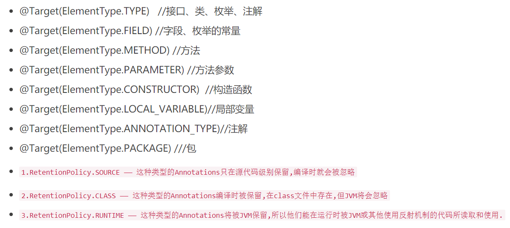
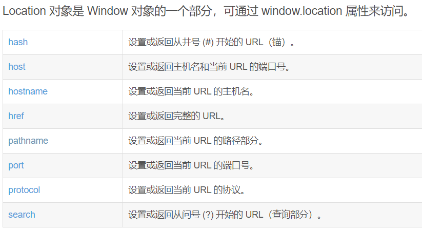

# Mall_Vue_SpringBoot
仿newbee-mall，学习开发的一个mall

2020年8月10日22点02分：
- [x] 发现自己管理员端的输入验证都还没做啊
- [x] 分页功能理解的差不多了，明天上午把分页给搞定。
先用pageUtil来提取处理前端发过来的Map参数，提取出page页数和limit条数，类似与实体类
还有一个查询出来的数据主体pageResult：主要是四个数据：数据总条数，数据主体，总页数，当前页数，每页记录数。
最后返回的是Result，数据主体，响应码，响应信息。
Result还有一个具体的实体类叫做ResultGenerate，封装类，响应码，响应信息，响应主体，接收查询出来的数据主体PageResult

2020年8月12日14点34分记录：

- [x] 管理员账户个人信息修改页，修改完之后，少了提示框，少了前端控制跳转回登录页
- [x] SpringBoot后台com.fh.mall.controller.admin.AdminController.modify方法更改完数据之后，返回的不是字符串数据！！！需要在controller注解下返回json数据类型
- [ ] mallUser页面中表格时间数据格式化，表格的前进后退按钮都不显示，还有旁边的滚动条，太难看。
- [x] 去学习Java中注释的用法，以及TODO的作用
- [ ] 简单的逻辑验证能不能放到前端去？

2020年8月17日22点38分：
- [x] 获取配置文件中的路径信息一直为空（08点40分搞定）

2020年8月18日08点40分：
- [x] \mall\utils\GetUploadPath.java，把其中获得路径的方法给搞成静态的

2020年8月18日11点38分：
- [x] 后台管理页面轮播图业务层实现了分页数据查询，持久层5个接口全部能正常运行
- [x] 接下来需要实现剩下的业务层逻辑
- [x] 前端页面的整合

2020年8月22日17点08分：

- [x] 轮播图管理页更新操作时，表格的个别字段隐藏问题
- [x] 表格显示url字段直接显示图片问题，url格式判断问题
- [x] 添加轮播图功能，1. 先实现上传图片的功能（图片后缀判断）

2020年8月23日15点07分：

上午时候把这几天做的例子给学长看了，学长问了一些问题，现在这里记录一下。

1. 写验证码的流程。
2. 登录操作时session和cookie的区别，session和cookie是如何协作的。
3. 什么是请求方式，什么是同源策略，什么是跨域问题，什么是URI、URL、URN。
4. SpringBoot中过滤器、拦截器、aop的关系，及作用时间。
5. SpringBoot中的生命周期
6. Vue中的生命周期

- [x] 接下来去写前端的轮播图展示

2020年8月30日19点45分：  
开始处理商城登录的后端逻辑
1. 数据库添加测试数据
2. 制作token
3. [制作Token过程中的数字签名和数字证书是什么](http://www.ruanyifeng.com/blog/2011/08/what_is_a_digital_signature.html)
4. [什么是摘要算法，摘要算法和加密算法的关系,摘要算法，数字签名，数字证书等的关系](https://www.jianshu.com/p/47a8498e47d0)
5. [分层领域模型](https://juejin.im/post/6844903636334542856#heading-1)
6. [为什么用自定义参数解析器？]()
7. [spring mvc自定义参数解析器](https://blog.csdn.net/guanzhengyinqin/article/details/85255840)
8. [什么是RESTful风格，他和传统的开发相比有什么不同，为啥出现了这种风格？](https://www.jianshu.com/p/91600da4df95)
9. [简单了解RESTful风格下HTTP的响应码意义](https://www.jianshu.com/p/7893169a7c93)
10. [Apache之HTTP协议,此部分还需要去详细了解一下才行](https://blog.51cto.com/shjia/1432670)
11. [自定义注解的基本概念](https://blog.csdn.net/luckykapok918/article/details/79290109)
12. [springBoot自定义注解,以及aop和自定义注解的使用](https://www.zhihu.com/question/24863332)
13. 自定义注解参数含义  

14. [RuntimeException和Exception的区别是啥？](https://zhuanlan.zhihu.com/p/47258269)
15. [Swagger非全局、无需重复输入header参数配置](https://www.jianshu.com/p/6e5ee9dd5a61)
16. [Swagger注解详解](https://blog.csdn.net/xiaojin21cen/article/details/78654652)
17. Swagger的多模块配置方法1. 在配置文件中创建多个Docket。2. 根据源码自己写方法去 遍历目录，spring could项目的多模块配置可以瞅瞅
18. [equals时候，变量放在前后的区别](https://blog.csdn.net/zhaoxiangjun_/article/details/77093294)
19. [Spring Boot中使用Swagger2异常：Illegal DefaultValue 0 for parameter type integer](https://cloud.tencent.com/developer/article/1600539)
20. [Swagger分组](https://blog.csdn.net/sinat_35626559/article/details/104920802)
21. [SpringBoot全局异常处理](https://www.cnblogs.com/fishpro/p/spring-boot-study-throwable.html#_label2)
22. [JS中location.hostname和location.host区别](http://www.5idev.com/p-javascript_location_hostname.shtml)
23. [java中的正则Pattern和Matcher](https://blog.csdn.net/yin380697242/article/details/52049999)

2020年9月5日20点27分：  
前台login模块已经开发完毕，接下来就开始写classify分类模块

2020年9月25日22点17分：  
最近因为开发别的项目有点耽误，今天开始搞起来，  
先来记录一个问题
1. [window.location得到的信息问题](https://www.cnblogs.com/zhabayi/p/6419938.html)

2. [js 截取字符问题](https://www.jb51.net/article/42482.htm)
3. [jQuery中的ajax](https://www.cnblogs.com/tylerdonet/p/3520862.html)

2020年9月28日08点01分：  
在开发中发现一个问题，查询到的数据总页数有点不对劲，后面再说吧

2020年10月1日15点26分：
1. [jQuery中监听事件一般都是用on来监听]()
2. 
